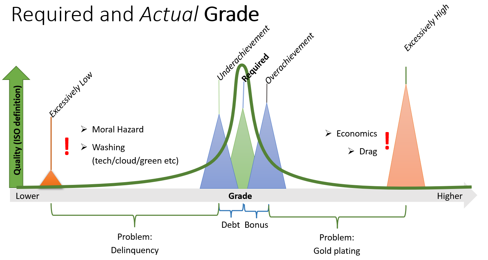
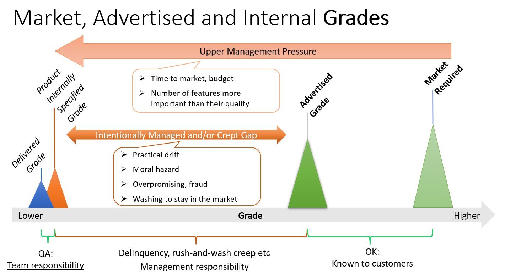

# Is Agility Leading To Quality Loss?

## Head

Agile teams are falling more easily victims to abusing corner-cutting management. This often results in inadequate quality grades. Waterfall projects, although inadequate for software development IMHO, have better management tutelage.

To show this, first we need to separate the "quality" and "grade" concepts as in ISO 9000 family of standards.
https://www.qualitygurus.com/quality-vs-grade/

Being agile means that your target grade may shift in time, it's not something that you "specify in detail" upfront. The base idea is to shift as the customer needs and this requires a customer centric management approach: https://hbr.org/2010/01/the-age-of-customer-capitalism

In reality, there are many companies that are still not implementing a customer centric approach, but a financial stakeholders one. These are misusing not only agility but also other tools such as NPS: https://hbr.org/2021/11/net-promoter-3-0

Management override capability for various details make agile teams vulnerable to practical drift, especially when the "customer" is perceived as the people paying your salary and bonuses, not the people whose life is improved by your product.

In these situations, product grade is one of the main aspects getting sacrificed, and management is only partially aware. A general culture of professional washing crept in many companies.

The ticketing abuse phenomenon, maybe unjustly associated to tools like JIRA and agility in general is actually not a characteristic of implementing agile methods, but rather a consequence of the fact agile teams require some tutelage against upper management abuse.

Note: "Moral hazard" in this thread is intended as engineering the offer in such a manner that is extremely expensive or unpractical for the customer to expose the product grade inadequacy

Credits for my personal understanding of this domain go to:

-   [Allen Holub](https://twitter.com/allenholub)
-   [Gregor Hohpe](https://twitter.com/ghohpe)
-   [Fred Reichheld](https://twitter.com/FredReichheld)
-   [TSIA](https://www.tsia.com)
-   [HBR](https://hbr.org)